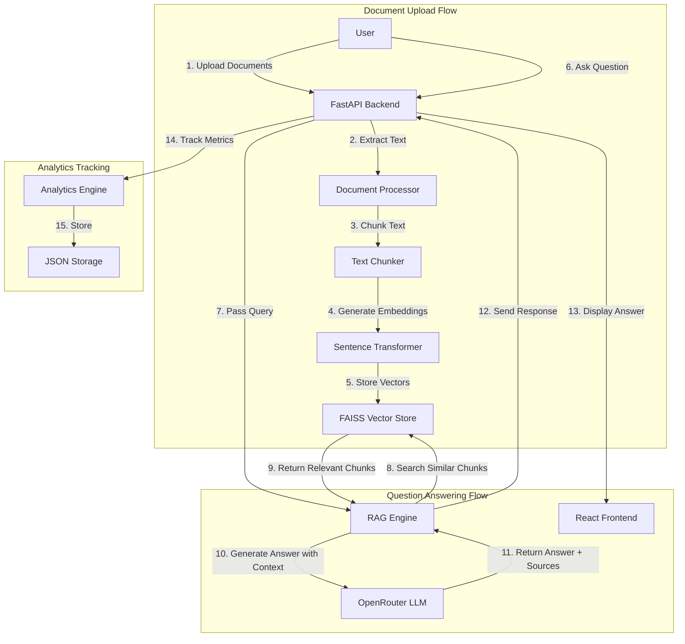

# WorkMaster AI - Intelligent Document Q\&A System

A RAG-powered AI assistant that answers questions exclusively from your uploaded documents, with source citations and confidence scoring.

## 1. Problem Statement

**For Companies:**

- New employees spend 2–3 months searching through manuals to understand and follow company policies.
- Required data is distributed across multiple documents, making it difficult to search efficiently.

**For Students:**

- Spend 3-4 hours searching for answers that should take 2-5 minutes
- Generic AI tools give wrong answers that don't match their syllabus
- Study materials are scattered across notes, textbooks, and slides

**Why This is Painful:**
People waste valuable time searching for information that already exists in their documents. Current solutions either give generic internet answers (not from your specific content) or require manual searching through hundreds of pages.

## 2. Constraints \& Assumptions

**Technical Constraints:**

- RAG (Retrieval Augmented Generation) requires proper document chunking to maintain context
- Vector embeddings need efficient storage and fast similarity search
- LLM responses must be grounded in source documents to prevent hallucinations

**Key Assumptions:**

- Users have documents in PDF, DOCX, or TXT format
- Questions are related to uploaded content

**What Makes This Hard:**

- Extracting clean text from various document formats
- Chunking text without losing context
- Matching user questions to relevant document sections


## 3. Proposed Solution

**Core Idea:**
A RAG based system that ONLY answers questions from uploaded documents, with every answer showing exact source citations and understands context and meaning, not just keywords.

**Why RAG Over Alternatives:**


| Approach | Why We Didn't Choose It |
| :-- | :-- |
| Basic keyword search | Misses semantic meaning, can't understand context |
| Generic ChatGPT | Gives internet answers, not from your specific documents |
| **RAG (Our Choice)** | **Cost-effective, document-specific, always cite-able** |

**Key Tradeoffs:**

- **Accuracy over Speed:** We prioritize correct answers with sources over instant responses
- **Specificity over Generality:** Only answers from uploaded docs, won't give general knowledge
- **Transparency over Convenience:** Shows confidence scores even when they're low


## 4. System Architecture

### High-Level Architecture




### Component Breakdown

**Backend (Python/FastAPI):**

- **Document Processor:** Extracts text from PDF/DOCX/TXT files
- **Vector Store (FAISS):** Stores document embeddings for fast similarity search

- **Analytics Trackers:** Monitors knowledge gaps (companies) and weak topics (students)
- **Practice Generator:** Creates quiz questions from study materials using LLM  (students only) 

**Frontend (React):**

- **Landing Page:** User type selection (Student/Company)
- **Upload Interface:** Drag-and-drop document upload with progress tracking
- **Chat Interface:** Real-time Q\&A with source citations
- **Knowledge Gaps Dashboard:** Shows unanswered questions (companies)
- **Study Analytics:** Tracks weak topics and progress (students)
- **Practice Quiz:** AI-generated questions for self-assessment (students)

**Key Technology Choices:**


| Technology | Why Chosen |
| :-- | :-- |
| FAISS | Fast vector similarity search, embedded database (no separate server needed) |
| Sentence Transformers (all-MiniLM-L6-v2) | Efficient embeddings generation, runs locally without API costs |
| Google Gemini | Fast for rag based applications  |
| FastAPI | Fast async Python framework, auto-generated API docs |
| React | Component-based UI, smooth animations with Framer Motion |

### Data Flow Example

```
1. User uploads "Company_Policy.pdf"
2. Backend extracts text → splits into 512-char chunks
3. Each chunk converted to vector embedding
4. Stored in FAISS with metadata (filename, page number)
5. User asks: "What is the vacation policy?"
6. Question converted to embedding
7. FAISS finds top 5 most similar chunks
8. Chunks sent to LLM with prompt: "Answer based ONLY on this content"
9. LLM generates answer
10. System calculates confidence based on chunk similarity scores
11. Returns answer + source citations + confidence score
```


### Failure Modes \& Edge Cases

**Document Processing:**

- **Corrupt PDFs:** Error handling with user notification(like not a supported format to upload and report in upload page )
- **Large files (>50MB):** Chunked processing to prevent memory issues

**Query Handling:**

- **No relevant documents:** Returns "I don't have information about this" instead of guessing
- **Ambiguous questions:** LLM uses best available context, shows low confidence score
- **Concurrent uploads:** Batch wise proccessing of files

**Edge Cases Handled:**

- Empty documents
- Documents in unsupported formats
- Questions before any documents uploaded
- User switches between student/company modes (clears chat history)


## 5. Ideal End State (Production-Grade)

### Scalability Plan

**What Breaks First:**

1. **Vector Store:** FAISS is embedded database, will hit performance limits at ~100K documents
2. **LLM API Rate Limits:** OpenRouter has request limits, need queue/caching


**Production Improvements Needed:**


| Component | Current State | Production Need |
| :-- | :-- | :-- |
| Vector Store | FAISS (embedded) | Migrate to Pinecone/Weaviate for distributed storage |
| File Storage | Local filesystem | S3/Cloud storage  |
| Database | JSON files | PostgreSQL for user data, analytics |
| Authentication | None | OAuth2 + JWT tokens |
| Caching | None | Redis for frequent queries |


**Scaling Targets:**

- **Users:** Support 10,000+ concurrent users
- **Documents:** Handle 1M+ documents efficiently
- **Queries:** Process 100+ queries/second

**What Needs Hardening:**

- Input validation (prevent malicious file uploads)
- Rate limiting (prevent API abuse)
- Backup \& disaster recovery


## 6. Hackathon Scope \& Execution

### What We Built (24-Hour Sprint)

**Core Features Implemented:**
-Document upload (PDF, DOCX, TXT) with user type separation
-RAG-based Q\&A with source citations
-Confidence scoring system
-Knowledge gap tracking (companies)
-Weak topic identification (students)
-Practice quiz generator (students)
-Real-time chat interface with smooth animations
-Document management (view, delete)

**What's Stubbed/Simplified:**

- **User Authentication:** No login system - production needs OAuth2
- **Database:** Using JSON files instead of proper database
- **File Storage:** Local filesystem instead of cloud storage
- **Error Recovery:** Basic error handling, needs retry mechanisms

**Why This Slice Demonstrates Core Value:**
This demo proves the hardest technical challenges:

1. **RAG pipeline works:** Documents → embeddings → retrieval → answer generation
2. **Citation accuracy:** Every answer traceable to source
3. **Confidence scoring:** Reliable metric for answer quality
4. **Analytics tracking:** Knowledge gaps and weak topics properly identified
5. **Full user flow:** Upload → Ask → Learn → Practice

The stubbed parts (auth, scaling, cloud storage) are standard engineering practices. The unique value is in the RAG implementation and dual-mode features (student vs company).

## 7. How to Run / Demo

### Prerequisites

- Python 3.9+
- Node.js 16+
- OpenRouter API Key ([Get one here](https://openrouter.ai/))


### Backend Setup (Windows)

```bash
# Navigate to backend directory
cd backend

# Create virtual environment
python -m venv venv

# Activate virtual environment
.\venv\Scripts\Activate.ps1

# Install dependencies
pip install -r requirements.txt

# Create .env file
# Add the following to backend/.env:
```

**backend/.env:**

```
OPENROUTER_API_KEY=your_openrouter_api_key_here
SITE_URL=http://localhost:3000
SITE_NAME=WorkMaster AI
```

```bash
# Run backend server
python -m app.main
```

Backend will start at: `http://localhost:8000`

### Backend Setup (Mac/Linux)

```bash
# Navigate to backend directory
cd backend

# Create virtual environment
python3 -m venv venv

# Activate virtual environment
source venv/bin/activate

# Install dependencies
pip install -r requirements.txt

# Create .env file (same content as Windows)

# Run backend server
python -m app.main
```


### Frontend Setup (All Platforms)

```bash
# Open NEW terminal
# Navigate to frontend directory
cd frontend

# Install dependencies
npm install

# Create .env file
# Add the following to frontend/.env:
```

**frontend/.env:**

```
REACT_APP_API_URL=http://localhost:8000
```

```bash
# Run frontend development server
npm start
```

Frontend will open at: `http://localhost:3000`

### Quick Demo Flow

**For Company Mode:**

1. Select " For Company " on landing page
2. Upload a company document (policy, manual, etc.)
3. Ask questions like: "What is the vacation policy?"
4. Observe: Answer with source citations and confidence score
5. Click "Knowledge Gaps" to see unanswered questions

**For Student Mode:**

1. Select "For Student " on landing page
2. Upload study materials (textbook chapter, notes, etc.)
3. Ask questions about the content
4. Click "Study Analytics" to see weak topics
5. Click "Practice Quiz" to test yourself with AI-generated questions

## 8. Notes on AI Usage

This project used AI assistance (Claude,ChatGPT) for:

- Boilerplate code generation (FastAPI routes, React components)
- CSS styling and animations (Framer Motion)
- Documentation 
- Debugging and error handling

**Core Logic Designed by Team:**

- RAG architecture and pipeline design
- Confidence scoring algorithm
- Knowledge gap detection logic
- Weak topic identification algorithm
- Practice question generation prompts
- User flow and feature prioritization

